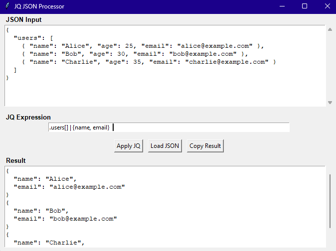

# Python-JQ-GUI

A graphical user interface for applying JQ expressions to JSON input. This tool provides a simple and intuitive way to use JQ without the command line.



## Features

*   Live JQ filtering of JSON data.
*   Load JSON from files.
*   Copy results to clipboard.
*   Format input JSON.
*   Clear input/output fields.
*   Status bar for feedback.
*   Easy theming with `ttkbootstrap`.

## Getting Started

### Prerequisites

*   Python 3.7+
*   Tkinter (usually included with Python standard library)
*   JQ installed on your system and available in your system's PATH.
    *   Verify by typing `jq --version` in your terminal.
    *   Installation: [https://jqlang.github.io/jq/download/](https://jqlang.github.io/jq/download/)

### Needed for the enhanced UI themes

*   `ttkbootstrap`: Install with `pip install ttkbootstrap`

### Installation

1.  Clone the repository:
    ```bash
    git clone https://github.com/aaabbbuuu/Python-JQ-GUI.git 
    cd Python-JQ-GUI
    ```
2.  (Optional) Create and activate a virtual environment:
    ```bash
    python -m venv venv
    # On Windows
    venv\Scripts\activate
    # On macOS/Linux
    source venv/bin/activate
    ```

### Running the Tool

To run the tool, execute:
```bash
python jq_gui.py
```

### Usage

* Paste or type your JSON into the "JSON Input" text area, or use the "Load JSON" button.
* Enter your JQ expression in the "JQ Expression" field.
* Click "Apply JQ" or press Enter in the expression field.
* The result will appear in the "Result" text area.
* Use "Copy Result" to copy the output.
* "Format Input JSON" will pretty-print the JSON in the input area.
* "Clear All" will clear all text fields.
* For a JQ tutorial, see: https://jqlang.github.io/jq/tutorial/

### Running Tests

To run tests, ensure you are in the project's root directory:
```bash
python -m unittest test_jqapp.py
```

Or, for more verbose output:
```bash
python -m unittest -v test_jqapp.py
```

## License

This project is licensed under the MIT License.