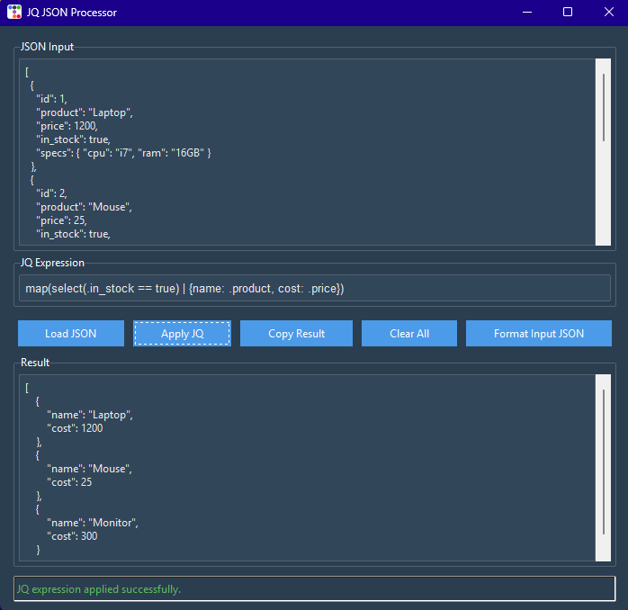

# Python-JQ-GUI

A graphical user interface for applying JQ expressions to JSON input. This tool provides a simple and intuitive way to use JQ without the command line.

## Getting Started

### Prerequisites

- Python 3.x
- tkinter library
- JQ installed on your system (https://jqlang.github.io/jq/)

### Installation

Clone the repository:
```bash
git clone https://github.com/aaabbbuuu/Python-JQ-GUI.git
```

### Running the Tool

To run the tool, execute:
```bash
python jq_gui.py
```

### Usage
Use: https://jqlang.github.io/jq/tutorial/ for a brief tutorial on how to use JQ



## Running Tests

To run tests, execute:
```bash
python -m unittest test_jqapp
```

## License

This project is licensed under the [MIT License](LICENSE).

## Contact

For support or queries, contact abu.t.hassan@gmail.com
